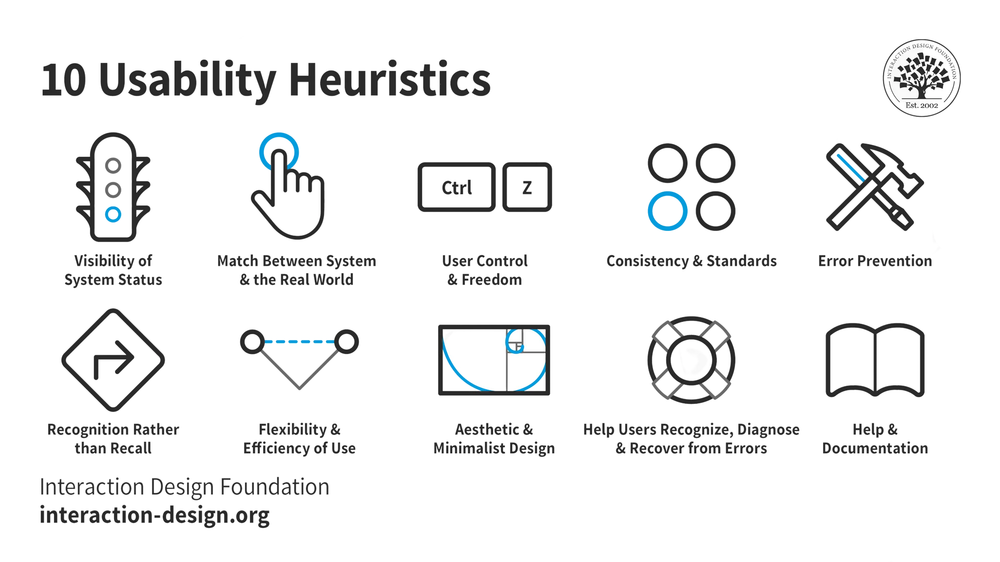

# Evaluation

## Heuristic Evaluation

Interaction Design Foundation - IxDF. (2016, May 25). What is Heuristic Evaluation (HE)?. Interaction Design Foundation - IxDF. https://www.interaction-design.org/literature/topics/heuristic-evaluation

Heuristic evaluation is a method in which experts utilize practical guidelines to assess the usability of user interfaces through independent walkthroughs, identifying and reporting issues. By employing established heuristics, such as Nielsen-Molich's principles, evaluators uncover insights that aid design teams in improving product usability early in the development process. These principles include:

- Keep users informed of status updates appropriately and promptly.
- Present information in ways that align with users' understanding of real-world operations and in their language.
- Provide users with control and easy error correction capabilities.
- Maintain consistency to avoid user confusion regarding terminology, icons, etc.
- Proactively prevent errors by either eliminating error-prone conditions or issuing warnings.
- Ensure visibility of information and instructions to help users recognize options and actions without relying on memory.
- Foster flexibility to enable experienced users to achieve goals more efficiently.
- Minimize clutter by including only relevant information for current tasks.
- Offer plain-language assistance for error resolution.
- Compile concise, searchable documentation outlining steps to overcome problems.

To conduct a heuristic evaluation, follow these steps:

1. Define the scope and objectives of the evaluation, whether it involves the entire product or specific procedures.
2. Understand the target audience's goals, contexts, etc., using user personas to gain insights from their perspective.
3. Select 3–5 evaluators with expertise in usability and the relevant industry.
4. Define 5–10 heuristics tailored to the system/product/design, potentially incorporating Nielsen-Molich's principles or others.
5. Provide evaluators with task instructions and severity codes to flag issues during the evaluation.
6. Conduct an initial walkthrough where evaluators freely explore the product to identify elements for analysis.
7. Perform a second walkthrough where evaluators systematically assess individual elements against the defined heuristics, documenting encountered issues.
8. Facilitate a debriefing session for evaluators to consolidate results and propose solutions for analysis.